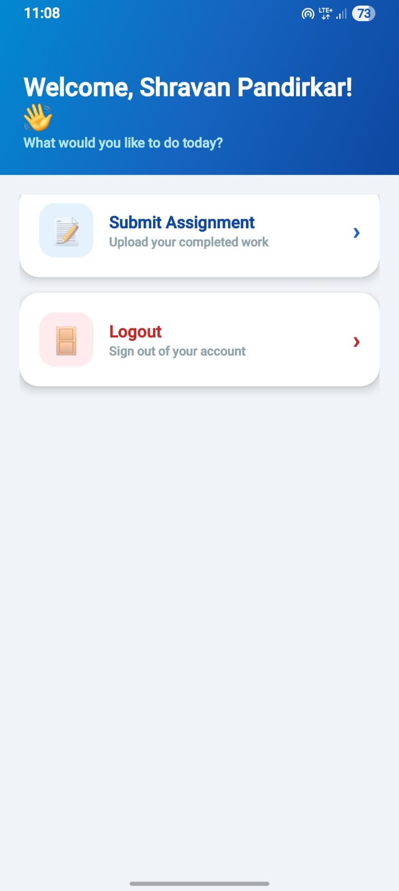
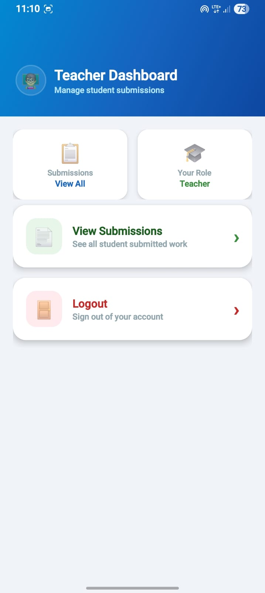
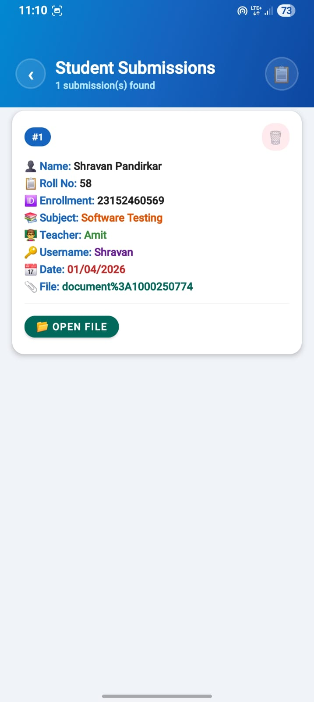

# 📚 Digital Assignment Submission App

A mobile application built with **Java** for **Android** that enables students to digitally submit their assignments — eliminating paper-based submissions and streamlining the process for both students and educators.

---

## ✨ Features

- 📤 Submit assignments directly from your Android device
- 📁 Attach files (PDFs, images, documents) to submissions
- 🔐 Secure login for students and teachers
- 📋 View submission history and status
- 🔔 Notifications for submission deadlines and feedback
- 👩‍🏫 Teacher dashboard to review and manage received assignments

---

## 🛠️ Tech Stack

| Layer        | Technology         |
|--------------|--------------------|
| Language     | Java               |
| Platform     | Android            |
| Build System | Gradle             |
| IDE          | Android Studio     |

---

## 📂 Project Structure

```
Digital-Assingment-Submission-App/
├── app/                    # Main application module
│   └── src/
│       └── main/
│           ├── java/       # Java source files
│           └── res/        # Layouts, drawables, strings
├── gradle/                 # Gradle wrapper files
├── build.gradle            # Project-level build config
├── settings.gradle         # Module settings
└── gradle.properties       # Gradle properties
```

---

## 🚀 Getting Started

### Prerequisites

- [Android Studio](https://developer.android.com/studio) (latest stable version)
- Android SDK (API Level 21+)
- Java 8 or above
- Git

### Installation

1. **Clone the repository**

   ```bash
   git clone https://github.com/Shravan-pandirkar/Digital-Assingment-Submission-App.git
   ```

2. **Open in Android Studio**

   - Launch Android Studio
   - Select **Open an existing project**
   - Navigate to the cloned folder and open it

3. **Sync Gradle**

   Android Studio will prompt you to sync Gradle. Click **Sync Now**.

4. **Run the app**

   - Connect a physical Android device (USB debugging enabled) **or** create an AVD emulator
   - Click the ▶️ **Run** button or press `Shift + F10`

---

## 📸 Screenshots

> _Add screenshots of your app here_

| Student dashboard | Teacher dashboard | Student Submission |
|---|---|---|
|  |  |  |

---

## 🤝 Contributing

Contributions are welcome! Here's how to get started:

1. Fork the repository
2. Create your feature branch: `git checkout -b feature/your-feature-name`
3. Commit your changes: `git commit -m "Add your message here"`
4. Push to the branch: `git push origin feature/your-feature-name`
5. Open a Pull Request

---

## 📄 License

This project is open source. Feel free to use, modify, and distribute it.

---

## 👨‍💻 Author

**Shravan Pandirkar**
- GitHub: [@Shravan-pandirkar](https://github.com/Shravan-pandirkar)

---

> ⭐ If you found this project helpful, please consider giving it a star!